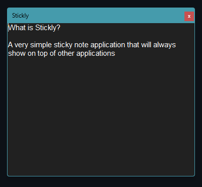
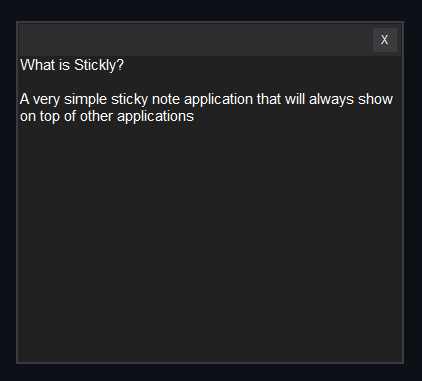

# What is Stickly
A very simple sticky note application that will always show on top of other applications

# Installation
For now you have to compile it yourself to run it. I plan on creating a release and add it to WinGet soon, I just want to test it a bit first to avoid any potential issues.

# Screenshots
The default look is using the regular windows titlebar

However, if you want, you can also enable a custom titlebar that is a bit more subtle.
